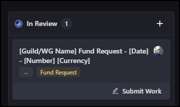

# Treasury Management

## Overview of the budget

The SNET Supervisory Council provides a third of their allocation to the Ambassador program, currently 57648 AGIX per month until 20th May 2024

At present each month Ambassador Role gets a Fixed Percent (17%) AGIX from the Ambassador Treasury that is distributed between the members where rest of the funds are distributed through **Fund Requests**

Ambassador Rewards are distributed after the end of the Month, on the first weeks Tuesday

## Introduction to Fund Requests

We have decided to allow certain roles to Request Funds from Ambassador Treasury

Currently, these roles are:

* Ambassadors&#x20;
* Work Group leads

Fund Requests must be submitted in your group’s own Dework space\
Here you can find an example [Template](https://app.dework.xyz/singularitynet-ambas/treasury-guild-87240/settings/templates?taskId=f9b09533-0b79-4e0e-9d8e-fe739a137fda) under Treasury Guild

To receive tokens from the **Fund Request** move the task under Review add the fund receiver and add the **Fund Request tag**

tasks with the Fund Request tag will be exported to Treasury Manager and will be audited.

## Auditing

We do the Auditing at regular Tuesday Distribution meetings

Before each bundle transaction, Treasury Guild checks if any Fund Requests are blocked in the 'Ambassadors Only Channel'

Fund Request can be blocked by consent of 3 Ambassadors or Workgroup Leads

Saturday, Sunday, and Monday Fund Requests that are over 500$ are not rewarded in the first following Distribution meeting

There has to be proof of requirements and deliverables where the Fund Request is over 100$

At least 6 different Ambassadors or Workgroup Leads need to approve the Fund Requests over 500$
